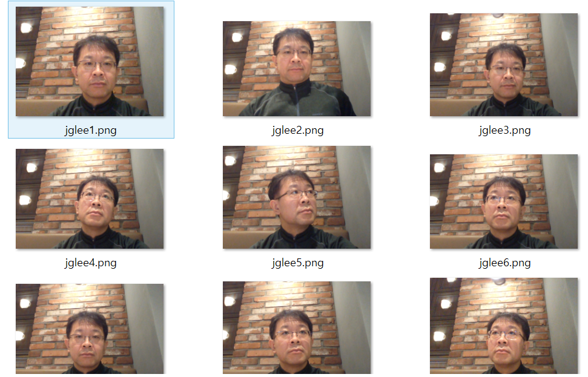
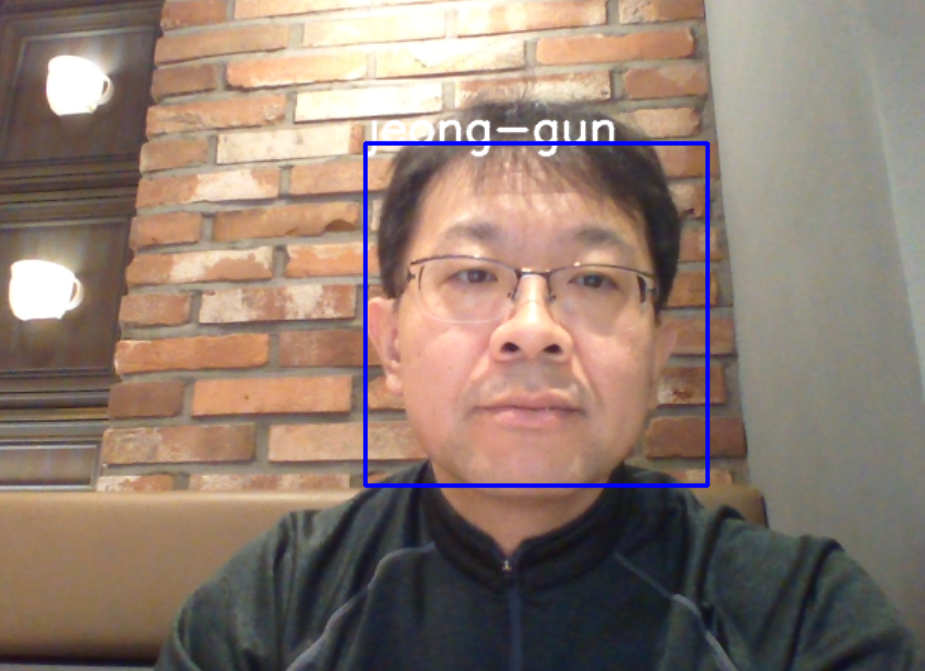

# faceid

## Face Detection and Identification for Smart Toy: Geomex Soft.

#### Jeong-Gun Lee
> School of Software, Hallym University
> Email : jeonggun.lee@gmail.com

*  *  *

인지형 스마트 토이를 만들기 위한 가장 기본적인 기능으로, 현재 토이 앞에 위치한 사람을 인식하는 것이 필요하다.
카메라를 통한 사람의 인식은 크게 두개의 스텝으로 이루어 진다.

   1. **Face Recognition**: 영상으로 부터 사람의 얼굴 부분을 검출
   2. **Face Identification**: 검출된 얼굴을 기존 학습된 데이터를 통해 ```누구```인지 파악

이러한 작업을 진행함에 있어 동영상 강의 및 코드를 오픈한 것이 있어 이를 기반으로 작업을 진행하고자 한다.

본 문서는 ```https://github.com/codingforentrepreneurs/OpenCV-Python-Series```에 기술된 코드에 대한 분석 및 응용에 대한 문서이다 [1].

*  *  *
 OpenCV를 처음 사용하는 사람으로 기존 프로그래밍 지식에 근거하여 분석을 진행한다.
 일차적으로 OpenCV를 설치하기 위하여 다음 명령어를 사용하였다 [2].
 
```
run pip install opencv-python-headless if you need only main modules
run pip install opencv-contrib-python-headless if you need both main and contrib modules 
```

이후, 해당 코드를 Github로 부터 cloning 한다.

```
git clone https://github.com/codingforentrepreneurs/OpenCV-Python-Series

Cloning into 'OpenCV-Python-Series'...
remote: Enumerating objects: 1, done.
remote: Counting objects: 100% (1/1), done.
remote: Total 216 (delta 0), reused 0 (delta 0), pack-reused 215
Receiving objects: 100% (216/216), 17.13 MiB | 2.90 MiB/s, done.
Resolving deltas: 100% (91/91), done.
```

cloning한 코드에서 가장 기본적인 코드인 ```base.py```의 코드를 살펴보면 아래와 같다.

```python
import numpy as np
import cv2

cap = cv2.VideoCapture(0)
# [3] 참조
# cap 이 정상적으로 open이 되었는지 확인하기 위해서 cap.isOpen() 으로 확인가능
# cap.get(prodId)/cap.set(propId, value)을 통해서 속성 변경이 가능.
# 3은 width, 4는 heigh
print 'width: {0}, height: {1}'.format(cap.get(3),cap.get(4))
cap.set(3,320)
cap.set(4,240)


while(True):
    # Capture frame-by-frame
    # ret : frame capture결과(boolean)
    # frame : Capture한 frame
    ret, frame = cap.read()
    
    if (ret):
        # Display the resulting frame
        cv2.imshow('frame',frame)
        # Grayscale을 원할 경우 image를 Grayscale로 Convert함.
        gray = cv2.cvtColor(frame, cv2.COLOR_BGR2GRAY)
        cv2.imshow('frame', gray)
        
        ## waitKey : 20 ms 대기, 0이라면 무한 대기
        if cv2.waitKey(20) & 0xFF == ord('q'):   # q 버튼이 눌리면 프로그램 while 
            break

# When everything done, release the capture
cap.release()
cv2.destroyAllWindows()
```

일단 영상을 쉽게 받아들이고 간단히 처리할 수 있는 느낌이여서 재밌다. ^^

*  *  *
다음은 영상으로 부터 얼굴 부분을 검출한 후에 ```검출된 얼굴 이미지를 이용하여 이후 절차인 인식을 위하여 학습```을 진행하는 코드를 보여준다 (```faces-train.py```).

```python
import cv2
import numpy as np
import os              # os 모듈은 Operating System의 약자로서 운영체제에서 제공되는 여러 기능을 파이썬에서 수행할 수 있게 해줌
from PIL import Image  # Pillow는 PIL(Python Image Library)를 계승한 라이브러리로, PIL 대신 사용하는 파이썬 라이브러리이다
import pickle          # pickle 모듈은 파이썬 객체를 파일로 저장하고 로딩하는 기능을 제공

BASE_DIR = os.path.dirname(os.path.abspath(__file__))
image_dir = os.path.join(BASE_DIR, "images")

face_cascade = cv2.CascadeClassifier('cascades/data/haarcascade_frontalface_alt2.xml')
recognizer = cv2.face.LBPHFaceRecognizer_create()

# 얼굴 데이터 획득을 위한 자료 구조
current_id = 0   # 구분할 얼굴의 수
label_ids = {}   # 라벨 리스트
x_train = []     # 얼굴 데이터 리스트
y_labels = []    # 해당 라벨 리스트

# 메인 for loop: 얼굴 사진을 추출하고 학습을 위한 데이터를 준비하는 단계
for root, dirs, files in os.walk(image_dir):
    for file in files:
	if file.endswith("png") or file.endswith("jpg"):
	    path = os.path.join(root, file)
	    label = os.path.basename(root).replace(" ", "-").lower()
	    #print(label, path)
	    if not label in label_ids:
		label_ids[label] = current_id
		current_id += 1
	    id_ = label_ids[label]
	    #print(label_ids)
	    #y_labels.append(label) # some number
	    #x_train.append(path) # verify this image, turn into a NUMPY arrray, GRAY
	    pil_image = Image.open(path).convert("L") # grayscale
	    size = (550, 550)
	    final_image = pil_image.resize(size, Image.ANTIALIAS)
	    image_array = np.array(final_image, "uint8")
	    #print(image_array)
	    faces = face_cascade.detectMultiScale(image_array, scaleFactor=1.5, minNeighbors=5)

	    for (x,y,w,h) in faces:
		roi = image_array[y:y+h, x:x+w]
		x_train.append(roi)
		y_labels.append(id_)

#print(y_labels)
#print(x_train)

with open("pickles/face-labels.pickle", 'wb') as f:
    pickle.dump(label_ids, f)

recognizer.train(x_train, np.array(y_labels))
recognizer.save("recognizers/face-trainner.yml")
```

이후에 얼굴 데이터베이스로 사용되는 디렉토리에 ```jeong-gun``` 디렉토리를 만들고 나의 사진을 9장 찍어서 넣었다.





다음은 메인 코드의 for 문이 완료된 후에 다음과 같은 프린트 문을 통하여 ```y_labels``` 및 ```labels_ids```가 어떤 데이터를 포함하고 있는지 알 수 있다.

```
print(y_labels)
print(label_ids)
```

위의 프린트 문을 통하여 나온 내용은 다음과 같다.
```
C:\Users\eulia\Python\OpenCV-Python-Series\src>python faces-train.py
[0, 0, 2, 2, 2, 3, 3, 3, 3, 3, 4, 4, 4, 4, 4, 4, 6, 6, 6, 6]
{'emilia-clarke': 0, 'fun': 1, 'jeong-gun': 2, 'justin': 3, 'kit-harington': 4, 'logo': 5, 'nikolaj-coster-waldau': 6, 'peter-dinklage': 7}
```
전체 7개의 디렉토리중에 얼굴이 검출된 디렉토리는 0, 2, 3, 4, 6, 7로 6개의 디렉토리에서 검출되었으며, 1 (fun)과 5 (logo)에 해당하는 디렉토리에서는 얼굴이 검출되지 않았음을 알 수 있다 (실제 fun과 log 디렉토리는 얼굴 사진을 포함하고 있지 않다).

더불어, 나의 경우 9장의 사진을 ```jeong-gun``` 디렉토리에 넣었지만, 3장에서만 얼굴을 검출하였고, 이 3장만 학습에 사용되었음을 알 수 있다.

*  *  *

최종적으로 학습된 모델에 근거하여 영상으로 부터 ```검출된 얼굴에 대한 identification을 진행```한다 ((```faces.py```)).

```python
import numpy as np
import cv2
import pickle

# 영상에서 "얼굴" 부분을 검출 하기 위한 Classifier 및 학습 데이터 로드
face_cascade = cv2.CascadeClassifier('cascades/data/haarcascade_frontalface_alt2.xml')
# "눈" 부분을 검출하기 위한 Classifier 및 학습 데이터 로드
eye_cascade = cv2.CascadeClassifier('cascades/data/haarcascade_eye.xml')
# "미소" 특성을 검출 하기 위한 Classifier 및 학습 데이터 로드
smile_cascade = cv2.CascadeClassifier('cascades/data/haarcascade_smile.xml')
# 위의 분류기에서 눈인식 및 미소인식은 사용되지 않는다. 
# 다만, 미소 인식기는 향후 인식한 사람의 기분등에 대한 데이터를 모아 인식한 사람의 속성으로 사용될 수 있을 것이다.

recognizer = cv2.face.LBPHFaceRecognizer_create()
# recognizer가 "face-trainner.yml"을 읽는다.
# "face-trainner.yml은 응용 엔지니어가 갖고 있는 영상 이미지 데이터에 근거하여 "faces-train.py"를 학습한 데이터이다.
# "face_cascade"가 얼굴을 검출하면 검출된 얼굴을 기존에 학습한 데이터와 연계하여 matching되는 얼굴을 찾게 된다.
recognizer.read("./recognizers/face-trainner.yml")

labels = {"person_name": 1}
with open("pickles/face-labels.pickle", 'rb') as f:
	og_labels = pickle.load(f)
	labels = {v:k for k,v in og_labels.items()}

# 영상 취득 시작
cap = cv2.VideoCapture(0)

while(True):
    # Capture frame-by-frame
    ret, frame = cap.read()
    gray  = cv2.cvtColor(frame, cv2.COLOR_BGR2GRAY)     # Grayscale로 변환
    
    # 영상으로 부터 얼굴 부분을 검출. [7] 참조
    # 얼굴부분이라고 인식된 위치 박스들의 리스트를 반환한다.
    faces = face_cascade.detectMultiScale(gray, scaleFactor=1.5, minNeighbors=5)
    
    # 얼굴 부분으로 인식된 각 위치 정보들에 대해서 for loop 진행
    for (x, y, w, h) in faces:
    	#print(x,y,w,h)
	# 관심 영역 추출 (grayscale 이미지, color 이미지) 두개를 뽑아냄.
    	roi_gray = gray[y:y+h, x:x+w] #(ycord_start, ycord_end)
    	roi_color = frame[y:y+h, x:x+w]

    	# recognize? deep learned model predict keras tensorflow pytorch scikit learn
	# 흑백 얼굴 이미지를 recognizer의 입력으로 주고, recognizer는 인식된 id 와 인식 신뢰도를 반환한다.
    	id_, conf = recognizer.predict(roi_gray)
	
	# 신뢰도가 4보다 크거나 같고 85보다 작거나 같을때,  인식된 이름 쓰기
	# 근데 "conf>=4 and conf <= 85" 조건이 조금 이해가 안된다. ???
    	if conf>=4 and conf <= 85:
    	    #print(5: #id_)
    	    #print(labels[id_])
    	    font = cv2.FONT_HERSHEY_SIMPLEX
    	    name = labels[id_]
    	    color = (255, 255, 255)
    	    stroke = 2
    	    cv2.putText(frame, name, (x,y), font, 1, color, stroke, cv2.LINE_AA)

    	img_item = "7.png"
    	cv2.imwrite(img_item, roi_color)

	# 박스 그리기
    	color = (255, 0, 0) #BGR 0-255 
    	stroke = 2
    	end_cord_x = x + w
    	end_cord_y = y + h
    	cv2.rectangle(frame, (x, y), (end_cord_x, end_cord_y), color, stroke)
    	#subitems = smile_cascade.detectMultiScale(roi_gray)
    	#for (ex,ey,ew,eh) in subitems:
    	#	cv2.rectangle(roi_color,(ex,ey),(ex+ew,ey+eh),(0,255,0),2)
    # Display the resulting frame
    cv2.imshow('frame',frame)
    if cv2.waitKey(20) & 0xFF == ord('q'):
        break

# When everything done, release the capture
cap.release()
cv2.destroyAllWindows()
```




*  *  *

# References

1. [OpenCV Python TUTORIAL #4 for Face Recognition and Identification](https://www.youtube.com/watch?v=PmZ29Vta7Vc)
   - [Github](https://github.com/jeonggunlee/OpenCV-Python-Series)
2. https://pypi.org/project/opencv-python/
3. https://opencv-python.readthedocs.io/en/latest/doc/02.videoStart/videoStart.html
4. [Raspberry Pi Face Recognition](https://www.pyimagesearch.com/2018/06/25/raspberry-pi-face-recognition/)
5. [음성인식: 라즈베리파이+Google Assist](https://blog.naver.com/renucs/221297676020)
6. [라즈베리파이에 구글 음성인식 사용하기 (최신 샘플코드 + 한국어)](http://diy-project.tistory.com/91)
7. [OBJECT DETECTION : FACE DETECTION USING HAAR CASCADE CLASSFIERS](https://www.bogotobogo.com/python/OpenCV_Python/python_opencv3_Image_Object_Detection_Face_Detection_Haar_Cascade_Classifiers.php)
